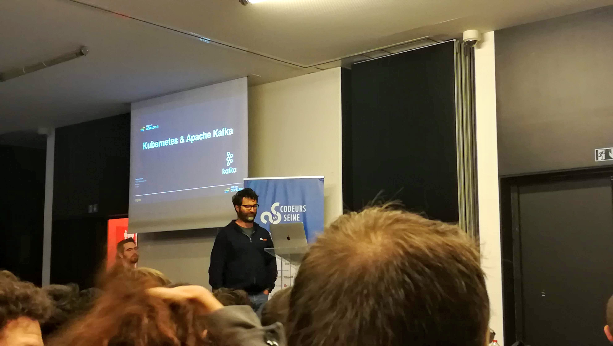

# Résumé de conférence de Guillaume Cavelier - Codeur en Seine 2018

## Cartouche d'identification

 - Manifestation : CodeursEnSeine 2018
 - Lieu : Kindarena - Palais des sports de Rouen - 40 rue de Lillebonne - 76000 ROUEN, FRANCE 
 - Conférence : Découvrir par l’exemple : Microservices et Event Sourcing avec Kafka et Kubernetes 
 - Horaire de la conférence : 15h40
 - Durée de la conférence : 50 minutes
 - Conférencier(s) :
   - Tugdual Grall (https://twitter.com/tgrall)
 - Audience : Environ 100 personnes (la salle D, d'une capacité de 100 personnes, était complète)
 - Auteur du billet : Guillaume Cavelier
 - Mots-clés
   - Kubernetes
   - Microservices
   - Kafka
   - Event Sourcing
   - Change Data Capture
   - Container
   - Fiabilité
   - Analyse du comportement utilisateur
 - URL de l'illustration : 

## Support
 - Lien vers le support (diapos) présenté en conférence : Cf la vidéo Youtube lorsqu'elle sera publiée
 - Nombre de diapos du support : Inconnu
 - Plan du support : 
   - Introduction
   - Event Drivent Architecture & Microservices
   - Containers, Kubernetes, & OpenShift
   - Apache Kafka & Streaming
   - Use Cases
      - The Stream Is The System of Record
      - Using CDC to add Microservices to Monolith
      - Event Sourcing: Healthcare, Retail

## Résumé
Tugdual a présenté comment mettre en place des microservices à l’aide de Kafka pour réaliser de l’event sourcing et Kubernetes pour les déployer. 

Kafka est un système de messaging type publish/subscribe qui permet de traiter des évènements (data streaming) et qui est tolérant aux pannes. L’intérêt de Kafka est qu’il va stocker tous les messages qu’il reçoit dans un broker. Nous allons donc pouvoir envoyer des messages et lire ceux envoyés. Afin d’accélérer les lectures et écritures, Kafka divise le stockage des messages en partitions. Plusieurs machines vont stocker des messages sur des partitions et plusieurs autres vont pouvoir les lire simultanément. Kafka permet également de répliquer les données entre brokers afin de ne pas perdre de données.

Kafka va également permettre de réaliser du processing sur nos données. Vu que tous nos messages sont stockés, nous allons pouvoir rejouer des messages envoyés plus tôt (event sourcing). Par exemple, nous allons pouvoir analyser le comportement d’utilisateurs qui dépenserait trop d’argent. L’utilisateur va utiliser sa carte sur internet, ses actions vont être enregistrées et il va être débité en temps réel. Quelque temps plus tard nous allons analyser ce qu’il a effectué et lui dire « Attention vous avez effectué des séries de transactions étranges sur cette période ». Cela peut permettre de détecter des fraudes par exemple. 

Tugdual a ensuite présenté Kubernetes. Kubernetes va permettre d’orchestrer les containers. Par exemple, nous allons pouvoir déclarer combien de container nous souhaitons en utilisation normale, au minimum ou lors de grosses charges. Kubernetes va également gérer la répartition de charge et être capable de démarrer de nouveaux containers à la volée.

## Architecture et facteur qualité
Le facteur qualité qui correspond le plus à cette conférence est la fiabilité. De par son fonctionnement, Kubernetes va permettre de garantir une qualité de service pour l'utilisateur en démarrant de nouveaux conteneurs si le service est surchargé. L'utilisateur va donc toujours avoir un accès rapide au service et les temps de réponse vont rester faibles. Kafka va également permettre de garantir l'accès aux données grâce à la réplication entre brokers. Il n'est donc pas possible de perdre des données pendant l'utilisation. De plus, le mécanisme d'event sourcing va également permettre d'analyser le comportement de l'utilisateur et de vérifier que celui-ci n'essaie pas de nuire au service.
